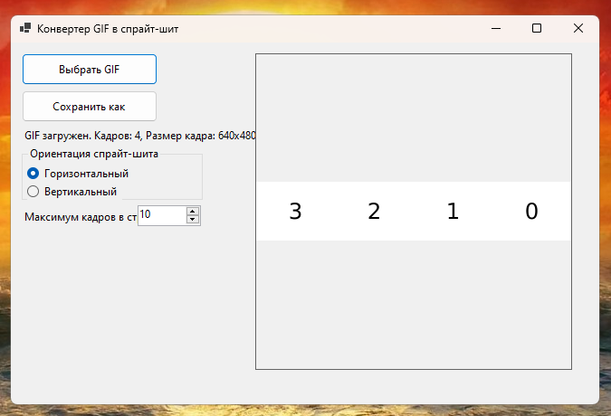
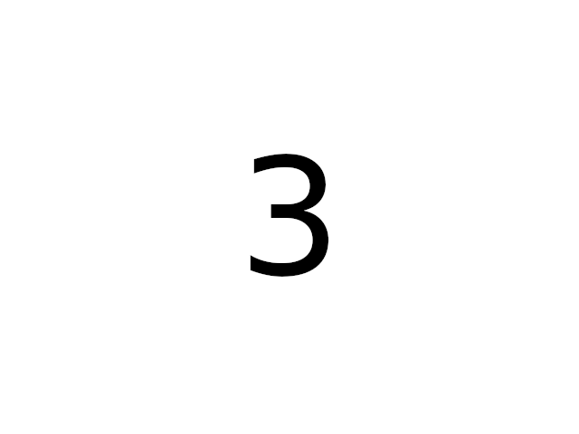
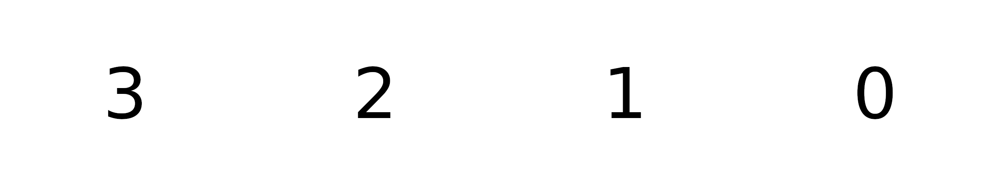
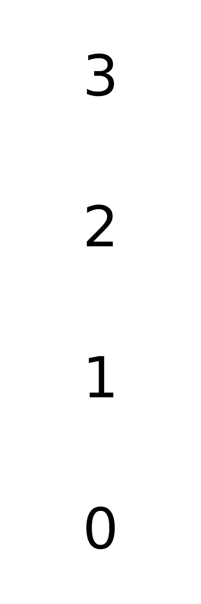
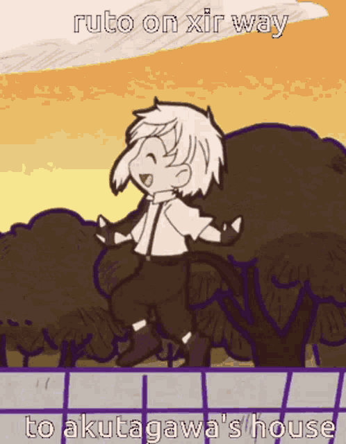
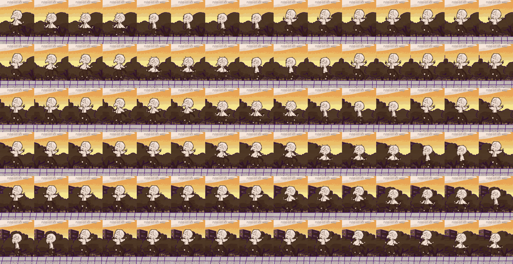

# GifToSprite

## Описание
GifToSprite — это приложение для конвертации GIF-файлов с анимацией в PNG-файлы с атласом спрайтов (спрайт-шитом). Оно позволяет преобразовывать анимированные GIF в статические изображения, где кадры анимации расположены в виде сетки (атласа), что удобно для использования в играх или графических редакторах.

С технологической точки зрения проект демонстрирует возможность создания приложений с пользовательским интерфейсом в Visual Studio Code (VS Code) и работу с обработкой графики, включая манипуляцию изображениями и файловыми операциями.

## Функции
- **Конвертация GIF в PNG**: Преобразование анимированного GIF в статический PNG-атлас с спрайтами.
- **Выбор файлов**: Возможность находить файл GIF и сохранять результат в PNG с помощью встроенного файлового браузера.
- **Настройка атласа**: 
  - Изменение количества кадров в строке атласа.
  - Выбор распределения кадров: вертикальное или горизонтальное расположение на итоговом изображении.

## Инструкция по использованию
1. Скачайте релиз приложения из раздела [Releases](https://github.com/yourusername/yourrepo/releases) на этой странице (файл с расширением .exe или аналогичным для вашей ОС).
2. Запустите приложение.
3. Выберите GIF-файл через файловый браузер.
4. Настройте параметры атласа: укажите количество кадров в строке и выберите ориентацию (вертикальную или горизонтальную).
5. Сохраните результат в формате PNG.

### Системные требования
- Операционная система: Windows(в зависимости от релиза).

## Скриншоты
  
*Пример главного окна приложения.*

  
*Результат конвертации GIF в PNG-атлас.*

  
*Результат конвертации GIF в PNG-атлас.*

  
*Результат конвертации GIF в PNG-атлас.*

  
*Результат конвертации GIF в PNG-атлас.*

  
*Результат конвертации GIF в PNG-атлас.*

## Технологии
- Разработано в Visual Studio Code.
- Используются библиотеки для обработки изображений (например, Canvas API или подобные).

## Автор
[Internal Observer] — [george-marinichev@mail.ru].

Если у вас есть вопросы или предложения, создайте Issue в репозитории!
